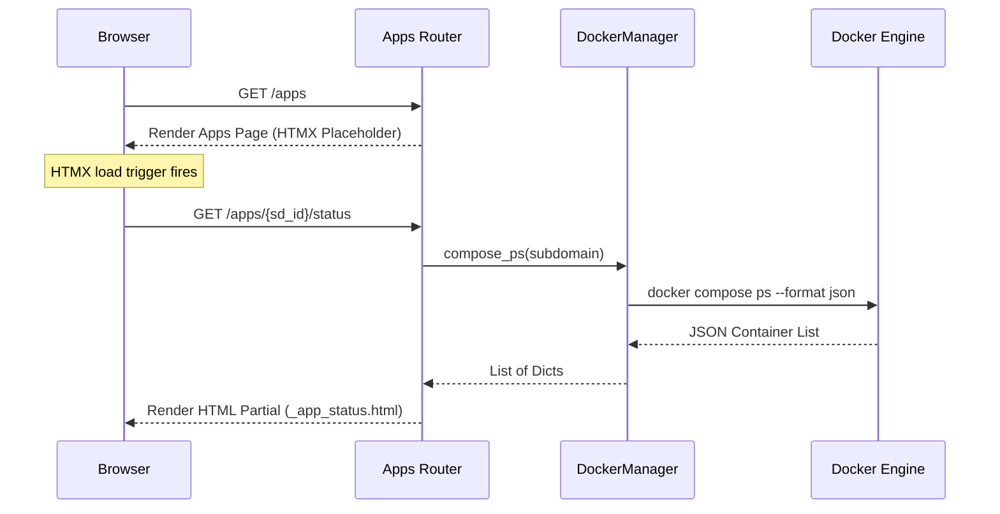

# Technical Design: UI Restyling & SysManage Integration

This document outlines the technical design for restyling the user interface of `pit-panel` and completing the integration of the System Management (`SysManage`) dashboard.

---

## 1. System Architecture & Component Design

### 1.1 Dynamic Theme & Typography Loading
- **Fonts Loading**: Google Fonts (`Inter` for body copy, `Outfit` for headings, `JetBrains Mono` for monospace terminal and code blocks) will be imported at the top of the `<head>` in [base.html](file:///C:/Users/pietr/progetti/pit-panel/src/pit_panel/web/templates/base.html).
- **Tailwind Extension**: The inline Tailwind CSS CDN configuration will be extended:
  ```javascript
  tailwind.config = {
      darkMode: 'class',
      theme: {
          extend: {
              colors: {
                  surface: {
                      50: '#f8fafc', 100: '#f1f5f9', 200: '#e2e8f0', 300: '#cbd5e1',
                      400: '#94a3b8', 500: '#64748b', 600: '#475569', 700: '#334155',
                      800: '#1e293b', 850: '#172033', 900: '#0f172a', 950: '#020617',
                  }
              },
              fontFamily: {
                  sans: ['Inter', 'ui-sans-serif', 'system-ui', 'sans-serif'],
                  heading: ['Outfit', 'sans-serif'],
                  mono: ['JetBrains Mono', 'monospace'],
              }
          }
      }
  }
  ```

### 1.2 Sidebar Active Detection
- **Detection Script**: A DOMContentLoaded listener in `base.html` will detect the current `window.location.pathname` and dynamically assign the `.active` classes to the matching sidebar item:
  ```javascript
  document.addEventListener('DOMContentLoaded', () => {
      const currentPath = window.location.pathname;
      document.querySelectorAll('.sidebar-link').forEach(link => {
          const path = link.getAttribute('data-path');
          if (path === '/' && currentPath === '/') {
              link.classList.add('active');
          } else if (path !== '/' && (currentPath === path || currentPath.startsWith(path + '/'))) {
              link.classList.add('active');
          }
      });
  });
  ```

### 1.3 Asynchronous App Status Columns
- **Route Endpoint**: Add a non-blocking GET route to [apps.py](file:///C:/Users/pietr/progetti/pit-panel/src/pit_panel/web/routes/apps.py):
  `GET /apps/{sd_id}/status`
- **Controller Logic**:
  1. Retrieve `Subdomain` from DB.
  2. If type is configured, query containers via `DockerManager(settings.apps_dir).compose_ps(subdomain)`.
  3. Count total containers and active ones (where `"Status"` contains `"Up"`).
  4. Render template partial `partials/_app_status.html` containing:
     ```html
     <div class="flex items-center gap-2">
         
         <span class="badge badge-green">Active</span>
         
         <span class="badge badge-red">Inactive</span>
         
         <span class="text-xs font-mono text-gray-500 dark:text-gray-400">{{ running_count }}/{{ total_count }} running</span>
     </div>
     ```
- **Apps Dashboard**: Integrate `hx-get="/apps/{{ sd.id }}/status" hx-trigger="load"` to lazily render the status badges.
- **Card Hover & Deploy Prevention**: Card hover triggers `hover:scale-[1.02] hover:-translate-y-0.5 hover:shadow-lg transition-all duration-200`. Buttons and inputs will bind to an Alpine.js state `isSubmitting` to disable inputs and show the spinning indicator during deployment.

### 1.4 Retro Terminal UI Emulator
- **Layout & Structure**: Wrap outputs in [system_manage.html](file:///C:/Users/pietr/progetti/pit-panel/src/pit_panel/web/templates/system_manage.html) with a terminal wrapper:
  ```html
  <div class="bg-slate-950 border border-slate-800 rounded-lg shadow-2xl overflow-hidden mt-8">
      <div class="bg-slate-900 border-b border-slate-800 px-4 py-2 flex items-center justify-between">
          <div class="flex gap-1.5">
              <span class="w-3 h-3 bg-red-500 rounded-full"></span>
              <span class="w-3 h-3 bg-yellow-500 rounded-full"></span>
              <span class="w-3 h-3 bg-green-500 rounded-full"></span>
          </div>
          <span class="text-xs text-slate-500 font-mono">bash (systemctl)</span>
          <div class="w-12"></div>
      </div>
      <div class="p-4 h-96 overflow-y-auto font-mono text-sm text-emerald-400">
          <pre id="result" class="whitespace-pre-wrap">Results will appear here...</pre>
      </div>
  </div>
  ```
- **Double-Confirmed Reboot**: A checkbox or a dual-state button using Alpine `x-data="{ armed: false }"` prevents execution:
  ```html
  <div x-data="{ armed: false }">
      <button type="button" x-show="!armed" @click="armed = true" class="btn-danger bg-red-600">Reboot Server</button>
      <div x-show="armed" class="flex items-center gap-3">
          <button type="submit" class="btn-danger bg-red-700 font-bold">CONFIRM REBOOT NOW</button>
          <button type="button" @click="armed = false" class="btn-ghost">Cancel</button>
      </div>
  </div>
  ```

---

## 2. Affected Files

1. **Templates**:
   - [base.html](file:///C:/Users/pietr/progetti/pit-panel/src/pit_panel/web/templates/base.html) (Google Fonts, Tailwind CSS Configuration, active link highlighting)
   - [apps.html](file:///C:/Users/pietr/progetti/pit-panel/src/pit_panel/web/templates/apps.html) (HTMX lazy column, disabled states, hover effects)
   - [system_manage.html](file:///C:/Users/pietr/progetti/pit-panel/src/pit_panel/web/templates/system_manage.html) (Double confirmation button, mock terminal UI)
   - `src/pit_panel/web/templates/partials/_app_status.html` (New status partial template)
2. **Routes**:
   - [apps.py](file:///C:/Users/pietr/progetti/pit-panel/src/pit_panel/web/routes/apps.py) (Add status route)

---

## 3. Data Flow



---

## 4. Testing & Rollout Strategy

### 4.1 Verification Plan
1. **Unit Tests**:
   - Mock `DockerManager.compose_ps` to verify `/apps/{sd_id}/status` correctly parses active counts.
   - Verify layout rendering with new fonts and tailwind settings.
2. **E2E/Playwright Integration**:
   - Confirm active links automatically receive the `.active` styling.
   - Confirm the reboot confirmation flow shows the armed check and prevents single-click reboots.
   - Validate live mock terminal container styles.

### 4.2 Rollout Plan
- Deployment contains frontend adjustments and is schema-neutral. No DB migration required.
- In case of failure, revert to previous branch using Git.
