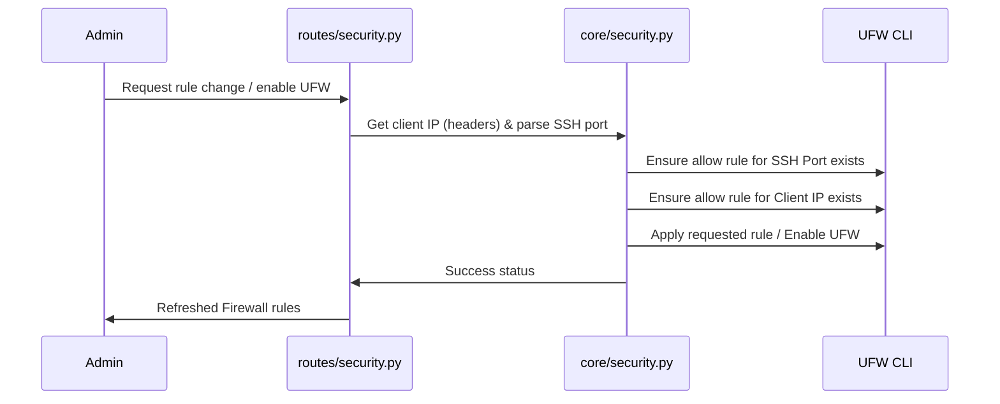
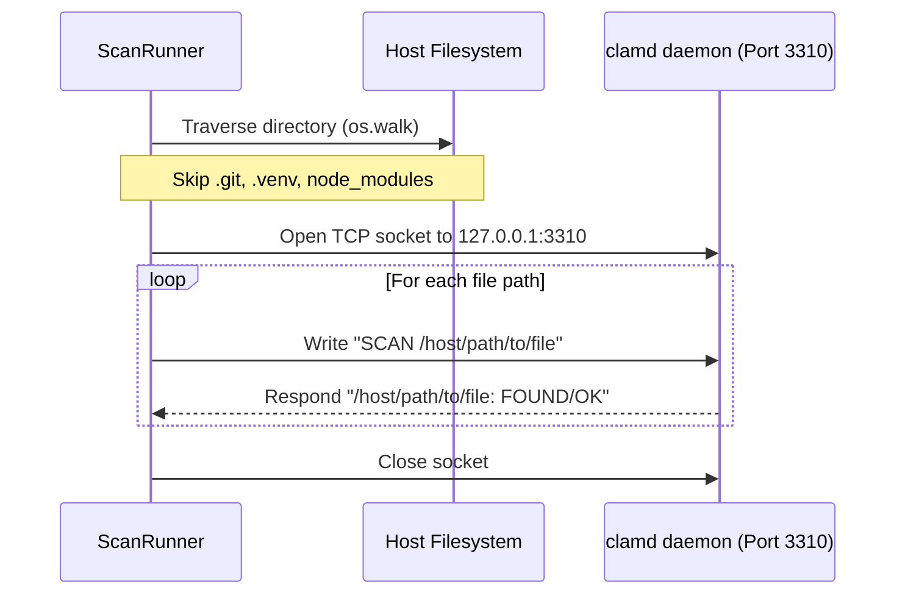

# Design: VPS Security Enhancements

This design document outlines the technical approach, architecture decisions, data flows, and testing strategy for implementing UFW rules management with lockout protection, Fail2ban jail tuning, persistent ClamAV scanner integration, rate-limiting, and Lynis audits.

---

## Technical Approach

### 1. UFW Firewall Rules Management & Lockout Protection
- **Rules Extraction**:
  We will parse the output of `ufw status numbered` using a regular expression:
  ```regex
  ^\[\s*(\d+)\]\s+(.*?)\s{2,}(ALLOW|DENY|LIMIT|ALLOW IN|DENY IN|LIMIT IN)\s{2,}(.*)$
  ```
  This extracts the rule index, target port/protocol, action, and source IP constraint.
- **SSH Port Detection**:
  We will attempt to read `/etc/ssh/sshd_config` directly in Python. If a `PermissionError` is raised, we will fallback to reading it using a subprocess command (`sudo cat /etc/ssh/sshd_config`). We search for any line matching `^Port\s+(\d+)` (case-insensitive, ignoring comments) and fallback to port `22` if not found.
- **Client IP Detection**:
  To support the reverse-proxy setup (Caddy), we will resolve the client's actual IP using the following header hierarchy:
  1. `X-Forwarded-For` (split by `,` and take first element)
  2. `X-Real-IP`
  3. `request.client.host` (fallback)
- **Lockout Protection**:
  Before enabling UFW (`ufw --force enable`) or reloading rules, we will execute:
  1. `sudo ufw allow <ssh_port>/tcp`
  2. `sudo ufw allow from <client_ip>`
- **Active Rule Deletion Protection**:
  When a user requests rule deletion, we match the rule's parameters. If the rule targets the active SSH port or matches the active client IP, we block the deletion request and return a `400 Bad Request` with an appropriate warning.

### 2. Fail2ban Jail Customization
- **Override Persistence**:
  Instead of editing the main `/etc/fail2ban/jail.local` directly, we will write per-jail overrides to `/etc/fail2ban/jail.d/pit-panel-overrides.local`. Using a `.local` file in `jail.d/` ensures it overrides settings in `/etc/fail2ban/jail.local` according to Fail2ban's loading precedence.
- **Applying Overrides**:
  We will read existing settings using:
  ```bash
  sudo fail2ban-client get <jail> <parameter>
  ```
  When updating, we validate that the input parameters (`bantime`, `findtime`, `maxretry`) are positive integers, write them to `/etc/fail2ban/jail.d/pit-panel-overrides.local` using `sudo tee`, and reload the service:
  ```bash
  sudo fail2ban-client reload
  ```
  This applies the configurations instantly without restarting the full daemon.

### 3. ClamAV Daemon Malware Scans & Folder Exclusions
- **Daemon Lifecycle**:
  We will start a persistent `clamav-daemon` container named `pit-panel-clamav` using the following parameters:
  - Image: `clamav/clamav:latest`
  - Mounts: `-v /:/host:ro` (bind mounts the host filesystem as read-only under `/host`)
  - Ports: `-p 127.0.0.1:3310:3310`
- **Low Memory Protection**:
  Before enabling or starting the ClamAV daemon, we read `/proc/meminfo` or run `free -m`. If the total system memory is less than 2.0 GB, we block automatic startup, display a warning about resource constraints, and advise using the pattern-based fallback.
- **Folder Exclusions & Python Traversal**:
  Rather than calling recursive directory scans via `clamd` directly (which does not support dynamic folder exclusions on the fly), we will traverse the directory in Python using `os.walk`. We prune directories matching `.git`, `.venv`, and `node_modules` in-place.
- **Socket Scanning**:
  For all scanned files, we establish an async socket connection to `127.0.0.1:3310` and send the command `SCAN /host<path>` line-by-line using a persistent connection. This maintains high throughput and enforces exclusions.

### 4. API Rate Limiting
We decorate target endpoints with the existing `slowapi` limiter:
- `POST /setup-2fa`: `@limiter.limit("5/minute")`
- `POST /settings/update`: `@limiter.limit("10/minute")`
- `POST /api/file-manager/save`: `@limiter.limit("20/minute")`

### 5. Lynis Hardening Audits
- **Auditing**:
  We trigger the audit in the background: `sudo lynis audit system --quick`.
- **Parsing**:
  We read `/var/log/lynis-report.dat` (via `sudo cat`) and extract:
  - `hardening_index`
  - `warning[]` (list of warning strings)
  - `suggestion[]` (list of suggestion strings)
- **Caching**:
  Results are serialized and saved to `/var/lib/pit-panel/lynis_last_report.json`.
- **Dependency Handling**:
  If the `lynis` binary is not found, we run `sudo apt-get install -y lynis`. If installation fails, we return a detailed explanation.

---

## Architecture Decisions

| Option | Tradeoff | Decision |
| :--- | :--- | :--- |
| **ClamAV socket stream scan** | Python-based traversal has slight overhead, but allows directory pruning | **Python traversal + Socket Scan**: Allows pruning massive folders like `.venv` and `.git` before scanning, reducing scan times from minutes to seconds. |
| **Fail2ban Overrides Location** | Modifying `jail.local` directly vs writing to `/etc/fail2ban/jail.d/*.local` | **`/etc/fail2ban/jail.d/pit-panel-overrides.local`**: Keeps custom overrides separated, prevents conflicts with package upgrades, and inherits highest priority. |
| **IP Detection for Lockout** | Relying on `request.client.host` vs parsing proxy headers | **Proxy Header Hierarchy**: Supports production Caddy reverse proxy correctly (avoiding whitelisting `127.0.0.1`). |
| **UFW Rule Deletion** | Deleting by index vs blocking active SSH/client IP | **Block active SSH/IP deletion**: Avoids accidental lockouts and returns explicit error feedback to the admin. |

---

## Data Flow

### UFW Rule Modification & Lockout Prevention


### Persistent ClamAV Socket Scanner Flow


---

## File Changes

### 1. `src/pit_panel/core/security.py`
- Add `_detect_ssh_port()` and `_get_client_ip(request)` helpers.
- Add `_add_ufw_rule(port, protocol, action, source_ip)` and `_delete_ufw_rule(index)` functions with lockout validation.
- Implement `_get_jail_config(jail)` using `fail2ban-client`.
- Implement `_save_jail_config(jail, bantime, findtime, maxretry)` using config parser writing to `/etc/fail2ban/jail.d/pit-panel-overrides.local`.
- Implement `run_lynis_audit()` and the corresponding `/var/log/lynis-report.dat` parser.

### 2. `src/pit_panel/security/malware_scanner.py`
- Add persistent clamd runner using python socket connections.
- Implement memory check guards (read `/proc/meminfo`).
- Modify `scan_patterns` and ClamAV socket scanner to support directory pruning (excluding `.git`, `.venv`, and `node_modules`).

### 3. `src/pit_panel/web/routes/security.py`
- Expose UFW routes: `GET /security/ufw/rules`, `POST /security/ufw/rule`, `POST /security/ufw/delete/{index}`, `POST /security/ufw/enable`, `POST /security/ufw/disable`.
- Expose Fail2ban configuration routes: `GET /security/fail2ban/jail/{jail}/config`, `POST /security/fail2ban/jail/{jail}/config`.
- Expose Lynis audit endpoints: `POST /security/audit/run`, `GET /security/audit/report`.

### 4. `src/pit_panel/web/routes/settings.py`
- Add rate limiter to `POST /settings/update`.

### 5. `src/pit_panel/web/routes/auth_routes.py`
- Add rate limiter to `POST /setup-2fa`.

### 6. `src/pit_panel/web/routes/file_manager.py`
- Add rate limiter to `POST /api/file-manager/save`.

### 7. `src/pit_panel/web/templates/security.html`
- Update templates with UFW rules grid, Fail2ban per-jail configs dialog, ClamAV daemon toggles, and Lynis security audit reports visual components.

---

## Interfaces / Contracts

### 1. UFW Rules API
- **`GET /api/security/ufw/rules`**
  - **Response**: `200 OK`
    ```json
    [
      {
        "index": 1,
        "port": "22/tcp",
        "action": "ALLOW IN",
        "source": "Anywhere",
        "protocol": "tcp"
      }
    ]
    ```
- **`POST /api/security/ufw/rule`**
  - **Form Data**: `port` (str), `protocol` (str: tcp/udp/any), `action` (str: allow/deny), `source_ip` (optional str)
  - **Response**: `200 OK` or `400 Bad Request`

### 2. Fail2ban Jails API
- **`POST /api/security/fail2ban/jail/{jail}/config`**
  - **Form Data**: `bantime` (int), `findtime` (int), `maxretry` (int)
  - **Response**: `200 OK` or `400 Bad Request`

### 3. Lynis Audit API
- **`POST /api/security/audit/run`**
  - **Response**: `202 Accepted`
    ```json
    { "status": "running", "message": "System audit initiated in background" }
    ```
- **`GET /api/security/audit/report`**
  - **Response**: `200 OK`
    ```json
    {
      "hardening_index": 72,
      "scan_timestamp": "2026-07-02T11:22:07Z",
      "warnings": [
        "SSH daemon is not hardened"
      ],
      "suggestions": [
        "Configure SSH to use stronger cryptography protocols"
      ]
    }
    ```

---

## Testing Strategy

### 1. Unit Testing
- **SSH Config Parser**: Test parsing valid config, commented port lines, missing file, and verify port fallback logic.
- **UFW Status Parser**: Mock `ufw status numbered` stdout and verify regex parsing against multiple rule styles.
- **Lynis Dat Parser**: Verify correctness of report parser on a mock `/var/log/lynis-report.dat` input string.

### 2. Integration & End-to-End Testing
- **Rate Limiting**: Write tests targeting `/setup-2fa`, `/settings/update`, and `/api/file-manager/save` ensuring a sequence of requests correctly triggers `429 Too Many Requests`.
- **ClamAV Mock Scanner**: Test clamd socket scanning by stubbing socket connection responses.
- **UFW Lockout Verification**: Verify that commands to enable UFW are preceded by active IP/SSH port allow commands.

---

## Migration / Rollout

1. **Deployment**:
   - Install `slowapi` library if missing.
   - Deploy Docker container `clamav/clamav:latest` running in background.
2. **First Run Audit Check**:
   - Run system check to check if `lynis` is installed on target VPS.
3. **Rollback**:
   - Run `ufw disable` to restore firewall default rules if connection drops.
   - Delete `/etc/fail2ban/jail.d/pit-panel-overrides.local` and reload fail2ban client.

---

## Open Questions
- Should we support custom exclusion lists defined by the user in the UI, or are the hardcoded `.git`, `.venv`, and `node_modules` exclusions sufficient?
- Are there specific Debian variants that write Lynis report data to a path other than `/var/log/lynis-report.dat`?
