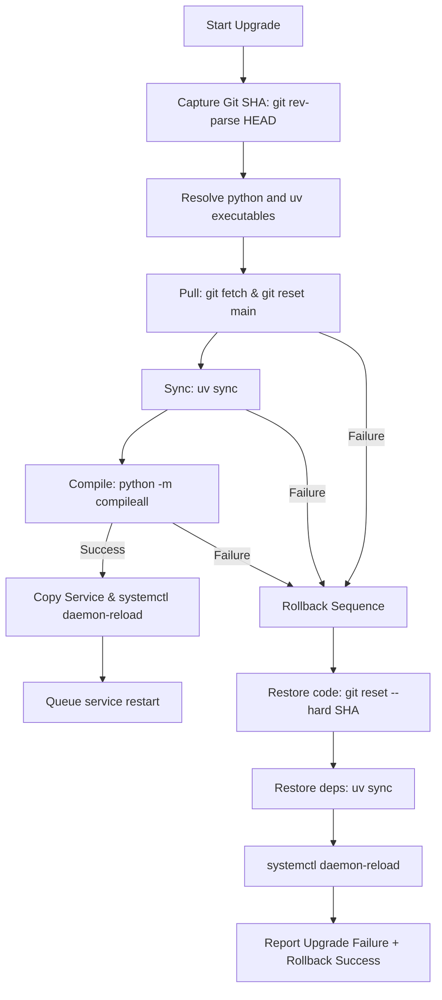

# Design: Secure Upgrade and Rollback

This document details the design for implementing pre-flight syntax checks, dynamic binary path resolution, and an automated rollback mechanism inside the system upgrade workflow of `pit-panel`.

---

## Technical Approach

The upgrade process in `src/pit_panel/web/routes/system.py` will be hardened against syntax errors, dependency mismatches, and deployment failures by:
1. **Pre-upgrade Target Capture**: Querying and storing the exact active Git HEAD SHA before executing any git or dependency actions.
2. **Dynamic Executable Resolution**: Moving away from hardcoded paths by searching for `uv` and using `sys.executable` for Python.
3. **Pre-flight Syntax Compilation**: Running `python -m compileall` post-sync to identify syntax defects before service reload.
4. **Automated Rollback**: Executing a hard reset, dependency sync, and daemon-reload in sequence if any step in the upgrade pipeline fails.

---

## Architecture Decisions

### Decision: Capture Recovery Target SHA
- **Choice**: Retrieve the active git commit hash using `git -C /opt/pit-panel rev-parse HEAD` before doing `git fetch` or `git reset`.
- **Rationale**: Storing the precise original HEAD SHA in memory guarantees a reliable rollback target, even if the remote branch main has advanced or local files become corrupted.

### Decision: Dynamic Binary Path Resolution
- **Choice**:
  - **Python**: Use `sys.executable` to guarantee we invoke the same Python interpreter and active virtual environment that runs the FastAPI daemon.
  - **UV**: Resolve via `shutil.which("uv")`. If not found, fallback to searching a prioritized list of common installation paths: `/usr/local/bin/uv`, `/usr/bin/uv`, `/opt/pit-panel/.venv/bin/uv`, and `/root/.cargo/bin/uv`.
- **Rationale**: Hardcoded `/usr/local/bin/uv` paths cause execution failures in local development, testing setups, or environments with different user home paths.

### Decision: Pre-flight Python Compilation Check
- **Choice**: Execute `python -m compileall -q <INSTALL_DIR>/src` after the dependency sync step.
- **Rationale**: Verifies syntax validity across all python source files. Any incomplete file download, merge conflict marker (e.g. `<<<<<<<`), or syntax error causes `compileall` to return a non-zero exit code, preventing application start-up failures.

---

## Data Flow



---

## File Changes

| File | Action | Description |
|------|--------|-------------|
| [src/pit_panel/web/routes/system.py](file:///C:/Users/pietr/progetti/pit-panel/src/pit_panel/web/routes/system.py) | Modify | Retrieve initial HEAD SHA, resolve paths dynamically, compile files via `compileall`, catch failures, execute rollback steps, and format response logs. |
| [tests/unit/test_system.py](file:///C:/Users/pietr/progetti/pit-panel/tests/unit/test_system.py) | Modify | Add unit tests to mock and verify compilation failure, rollback execution, dynamic path resolution, and error reporting. |

---

## Interfaces / Contracts

### Upgrade Step Configuration and Rollback
The steps will be executed in a try-except structure or sequenced list:
```python
# Resolved paths
python_bin = sys.executable
uv_bin = resolve_uv_bin() # Returns absolute path or raises error
original_sha = get_current_sha() # git rev-parse HEAD
```

### Upgrade Pipeline Steps
1. `["git", "-C", INSTALL_DIR, "fetch", "origin", "--prune"]`
2. `["git", "-C", INSTALL_DIR, "reset", "--hard", "origin/main"]`
3. `[uv_bin, "--directory", INSTALL_DIR, "sync"]`
4. `[python_bin, "-m", "compileall", "-q", f"{INSTALL_DIR}/src"]`
5. `["/bin/cp", f"{INSTALL_DIR}/packaging/pit-panel.service", "/etc/systemd/system/"]` (requires sudo)
6. `["/usr/bin/systemctl", "daemon-reload"]` (requires sudo)

### Rollback Pipeline Steps (Executed on Failure)
1. `["git", "-C", INSTALL_DIR, "reset", "--hard", original_sha]`
2. `[uv_bin, "--directory", INSTALL_DIR, "sync"]`
3. `["/usr/bin/systemctl", "daemon-reload"]` (requires sudo)

### Response Log Report
If a step fails, the `upgrade_result` HTML log will detail the failure step, error output, and the rollback progress:
```text
OK   git fetch origin
OK   git reset --hard origin/main
OK   uv sync
FAIL python -m compileall: SyntaxError in src/pit_panel/web/routes/system.py: line 132
[ROLLBACK] Restoring codebase to SHA 8fa3d2...
[ROLLBACK] OK   git reset --hard 8fa3d2
[ROLLBACK] OK   uv sync
[ROLLBACK] OK   systemctl daemon-reload
```

---

## Testing Strategy

- **Test Path Resolution**: Mock `shutil.which` and verify falling back works.
- **Test Compilation Check**: Mock `subprocess.run` to return exit code `1` for the compile step. Verify that the upgrade fails, `git reset` runs with the original SHA, `uv sync` runs, and rollback logs are generated.
- **Test Complete Upgrade**: Assert normal path returns success logs and restarts the service.
- **Test Rollback Failure**: Assert system handles rollback commands failing gracefully and logs the error.
